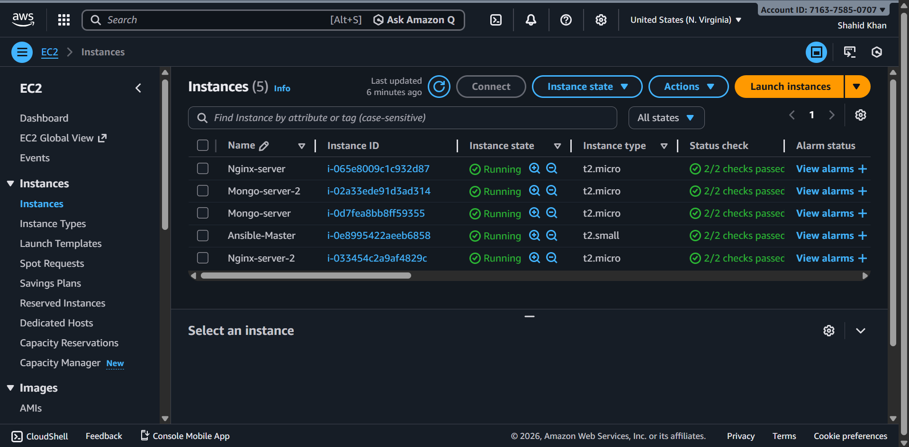
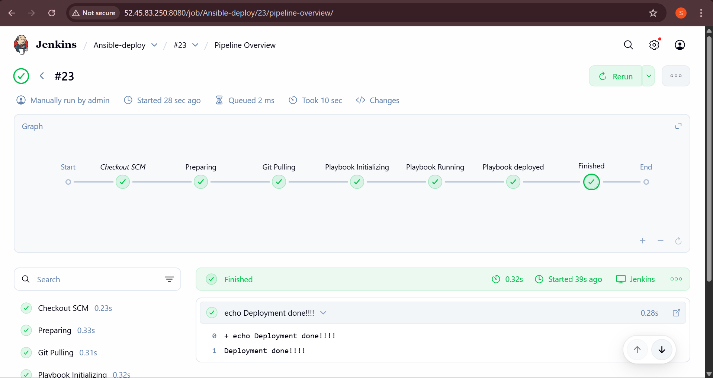
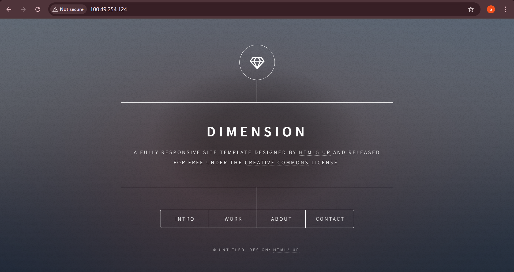

# Automating Infrastructure: Ansible Playbooks for Nginx and MongoDB Configuration


## 📋 Table of Contents
- [Introduction](#introduction)
- [Objectives](#objectives)
- [Prerequisites](#prerequisites)
- [Architecture Overview](#architecture-overview)
- [Infrastructure Components](#infrastructure-components)
- [Step-by-Step Implementation Guide](#step-by-step-implementation-guide)
  - [Part 1: Ansible Master & Jenkins Setup](#part-1-ansible-master--jenkins-setup)
  - [Part 2: Nginx Server Configuration](#part-2-nginx-server-configuration)
  - [Part 3: MongoDB Cluster Setup](#part-3-mongodb-cluster-setup)
- [Project Structure](#project-structure)
- [Usage](#usage)
- [Jenkins Pipeline](#jenkins-pipeline)
- [Conclusion](#conclusion)

## Introduction

In today's fast-paced world, the ability to quickly and efficiently deploy and manage infrastructure is crucial for the success of any project. This repository demonstrates how to automate the configuration of Nginx and the deployment of applications using **Ansible** and **Jenkins**. Additionally, it covers the process of setting up a robust and secure **MongoDB cluster** using Ansible roles.

By the end of this guide, you will have a comprehensive understanding of how to build a production-ready infrastructure that can be easily replicated and scaled.

## Objectives

The main objectives of this project are:

1. **Configure Nginx Server**: Automate the installation and configuration of Nginx, a high-performance web server, to serve as a reverse proxy for web applications.

2. **Deploy Applications with Ansible and Jenkins**: Integrate Ansible and Jenkins to automate the deployment process, ensuring consistent and error-free application releases.

3. **Configure a Production-Ready MongoDB Cluster**: Set up a MongoDB cluster with Ansible roles, ensuring high availability and fault tolerance.

## Prerequisites

Before starting with the automation process, ensure you have:

- **Basic knowledge of Ansible**: Understanding of Ansible playbooks, roles, and inventory
- **Working knowledge of Jenkins**: Familiarity with Jenkins and its CI/CD capabilities
- **Web Servers**: Basic knowledge of web servers like Nginx
- **MongoDB fundamentals**: Understanding the basics of MongoDB and database clusters
- **AWS Account**: Access to AWS for creating EC2 instances
- **SSH Key Pair**: For connecting to EC2 instances

### Useful Resources
- [Ansible Roles Documentation](https://docs.ansible.com/ansible/latest/playbook_guide/playbooks_reuse_roles.html)
- [Jenkins Documentation](https://www.jenkins.io/doc/)

## Architecture Overview



### Infrastructure Components

#### 1. **Ansible Master Server**
- Runs Ansible playbooks on remote servers through Jenkins jobs
- Hosts Jenkins for CI/CD automation
- Instance Type: `t2.small` (Ubuntu 22.04)

#### 2. **Nginx Servers (2)**
- Both servers are in different Availability Zones for high availability
- Serve web applications and act as reverse proxies
- Instance Type: `t2.micro` or `t2.small` (Ubuntu 22.04)

#### 3. **MongoDB Servers (2)**
- Both servers are in different Availability Zones for high availability
- No public IP (private servers for database security)
- Instance Type: `t2.small` or higher (Ubuntu 22.04)
- Port 27017 for MongoDB communication

## Step-by-Step Implementation Guide

### Part 1: Ansible Master & Jenkins Setup

#### Step 1: Create Ansible Master EC2 Instance

1. Launch an EC2 instance with the following specifications:
   - **Name**: `Ansible-Master`
   - **AMI**: Ubuntu 22.04 LTS
   - **Instance Type**: `t2.small`
   - **Security Group**: 
     - Port 22 (SSH) - Only from your IP
     - Port 8080 (Jenkins) - Only from your IP

2. Find your public IP:
   ```bash
   curl ifconfig.me
   ```
   Or visit: https://whatismyipaddress.com/

#### Step 2: Install Ansible on Ansible Master

SSH into the Ansible-Master server and run:

```bash
#!/bin/bash
apt install software-properties-common -y
add-apt-repository ppa:deadsnakes/ppa -y
apt install python3.11 -y
sudo update-alternatives --install /usr/bin/python python /usr/bin/python3.11 1
sudo apt-add-repository ppa:ansible/ansible -y
sudo apt update
sudo apt install ansible -y
ansible --version
```

#### Step 3: Install Jenkins on Ansible Master

```bash
#!/bin/bash
# For Ubuntu 22.04
# Installing Java
apt update -y
apt install openjdk-11-jre -y
java -version

# Installing Jenkins
curl -fsSL https://pkg.jenkins.io/debian/jenkins.io-2023.key | sudo tee \
  /usr/share/keyrings/jenkins-keyring.asc > /dev/null
echo deb [signed-by=/usr/share/keyrings/jenkins-keyring.asc] \
  https://pkg.jenkins.io/debian binary/ | sudo tee \
  /etc/apt/sources.list.d/jenkins.list > /dev/null
sudo apt-get update -y
sudo apt-get install jenkins -y
```

#### Step 4: Configure Jenkins



1. Access Jenkins at: `http://<Ansible-Master-Public-IP>:8080`

2. Get the initial admin password:
   ```bash
   sudo cat /var/lib/jenkins/secrets/initialAdminPassword
   ```

3. Install the following plugins:
   - **Ansible Plugin**: For Ansible integration
   - **Build Pipeline Plugin**: For creating deployment pipelines

#### Step 5: Set Up SSH Credentials

1. On Ansible-Master, generate SSH key pair:
   ```bash
   ssh-keygen -t rsa -b 4096
   ```

2. Copy the private key:
   ```bash
   cat ~/.ssh/id_rsa
   ```

3. In Jenkins:
   - Go to **Dashboard** → **Manage Jenkins** → **Credentials**
   - Click **System** → **Global credentials**
   - Click **+ Add Credentials**
   - Select **Kind**: `SSH Username with private key`
   - **ID**: `ansible-connect`
   - **Username**: `ubuntu`
   - Paste the private key content
   - Click **Create**

### Part 2: Nginx Server Configuration

#### Step 6: Create Nginx Servers

1. Launch two EC2 instances (in different AZs):
   - **Name**: `Nginx-Server-1` and `Nginx-Server-2`
   - **AMI**: Ubuntu 22.04 LTS
   - **Instance Type**: `t2.micro` or `t2.small`
   - **Availability Zones**: Different AZs for HA
   - **Security Group**:
     - Port 22 (SSH) - Only from Ansible-Master private IP
     - Port 80 (HTTP) - Open to all (0.0.0.0/0)

#### Step 7: Configure SSH Access from Ansible Master

1. Copy the `.pem` file from your local machine to Ansible-Master:
   ```bash
   # From local machine
   scp -i your-key.pem your-key.pem ubuntu@<Ansible-Master-IP>:~/.ssh/
   ```

2. On Ansible-Master, copy the public key:
   ```bash
   cat ~/.ssh/id_rsa.pub
   ```

3. On each Nginx server, add the public key:
   ```bash
   echo "<public-key-content>" >> ~/.ssh/authorized_keys
   chmod 600 ~/.ssh/authorized_keys
   ```

#### Step 8: Configure Ansible Inventory

On Ansible-Master, edit `/etc/ansible/hosts`:

```ini
[nginx_server]
<Nginx-Server-1-Private-IP>
<Nginx-Server-2-Private-IP>
```

#### Step 9: Run Nginx Deployment Pipeline

1. In Jenkins, create a new pipeline job
2. Configure the pipeline to use this repository
3. Run the pipeline with **Playbook Name**: `Installation`
4. Verify the deployment by accessing: `http://<Nginx-Server-Public-IP>`



### Part 3: MongoDB Cluster Setup

#### Step 10: Create NAT Gateway for Private MongoDB Servers

1. **Create NAT Gateway**:
   - Go to **VPC** → **NAT Gateways** → **Create NAT Gateway**
   - Select a public subnet
   - Allocate Elastic IP
   - Click **Create**

2. **Create Private Route Table**:
   - Go to **VPC** → **Route Tables** → **Create route table**
   - Select your VPC
   - Add route: Destination `0.0.0.0/0` → Target: NAT Gateway
   - Associate with private subnets

#### Step 11: Create MongoDB Servers

1. Launch two EC2 instances (in different AZs):
   - **Name**: `MongoDB-Server-1` and `MongoDB-Server-2`
   - **AMI**: Ubuntu 22.04 LTS
   - **Instance Type**: `t2.small` or higher
   - **Network Settings**:
     - Select private subnets (different AZs)
     - **Auto-assign Public IP**: Disabled
   - **Security Group**:
     - Port 22 (SSH) - Only from Ansible-Master private IP
     - Port 27017 (MongoDB) - Only from Ansible-Master private IP

#### Step 12: Configure Ansible Inventory for MongoDB

On Ansible-Master, update `/etc/ansible/hosts`:

```ini
[nginx_server]
<Nginx-Server-1-Private-IP>
<Nginx-Server-2-Private-IP>

[mongodb_servers]
<MongoDB-Server-1-Private-IP>
<MongoDB-Server-2-Private-IP>
```

#### Step 13: Configure SSH Access for MongoDB Servers

1. On each MongoDB server, add Ansible-Master's public key:
   ```bash
   echo "<ansible-master-public-key>" >> ~/.ssh/authorized_keys
   chmod 600 ~/.ssh/authorized_keys
   ```

#### Step 14: Run MongoDB Deployment Pipeline

1. In Jenkins, run the pipeline
2. The Ansible roles will:
   - Install MongoDB
   - Configure replica set/sharded cluster
   - Create database users
   - Set up security configurations

## Project Structure

```
CI-CD-Ansible/
├── Installation.yml                    # Master playbook
├── Jenkinsfile                         # Jenkins pipeline definition
├── assets/                             # Documentation assets
│   ├── AWS-Infra-Diagram.gif
│   ├── EC2.png
│   ├── jenkins.png
│   └── output.png
├── Ansible-Mongo-Role/
│   ├── hosts                           # MongoDB inventory
│   ├── mongodb.yml                     # MongoDB playbook
│   ├── mongodb/                        # MongoDB installation role
│   │   ├── tasks/
│   │   │   └── main.yml
│   │   ├── handlers/
│   │   │   └── main.yml
│   │   ├── defaults/
│   │   │   └── main.yml
│   │   └── vars/
│   │       └── main.yml
│   └── mongodb_users/                  # MongoDB users configuration role
│       ├── tasks/
│       │   └── main.yml
│       ├── handlers/
│       │   └── main.yml
│       ├── defaults/
│       │   └── main.yml
│       └── vars/
│           └── main.yml
└── Nginx-configuration/
    ├── hosts                           # Nginx inventory
    ├── nginx.yml                       # Nginx playbook
    ├── nginx/                          # Nginx installation role
    │   ├── tasks/
    │   │   └── main.yml
    │   ├── handlers/
    │   │   └── main.yml
    │   ├── defaults/
    │   │   └── main.yml
    │   └── vars/
    │       └── main.yml
    └── nginx_static_website/           # Static website deployment role
        ├── tasks/
        │   └── main.yml
        ├── handlers/
        │   └── main.yml
        ├── defaults/
        │   └── main.yml
        └── vars/
            └── main.yml
```

## Usage

### Prerequisites on Ansible Master

1. Ansible installed
2. Jenkins installed and configured
3. SSH access configured to all target servers
4. Proper inventory file at `/etc/ansible/hosts`

### Running Playbooks Manually

```bash
# Dry run (check mode)
ansible-playbook --check -i /etc/ansible/hosts Installation.yml

# Deploy Nginx
ansible-playbook -i /etc/ansible/hosts Nginx-configuration/nginx.yml

# Deploy MongoDB
ansible-playbook -i /etc/ansible/hosts Ansible-Mongo-Role/mongodb.yml

# Deploy everything
ansible-playbook -i /etc/ansible/hosts Installation.yml
```

### Running via Jenkins

1. Access Jenkins at: `http://<Ansible-Master-IP>:8080`
2. Select the pipeline job
3. Click **Build with Parameters**
4. Choose:
   - **Playbook Name**: `Installation` (or specific playbook)
   - **Playbook Action**: 
     - `Dry-Run` - Test without making changes
     - `Playbook-deploy` - Execute the deployment
5. Click **Build**

## Jenkins Pipeline

The `Jenkinsfile` defines a parameterized pipeline with the following stages:

1. **Preparing**: Initialize the pipeline
2. **Git Pulling**: Clone the repository
3. **Playbook Initializing**: Prepare Ansible environment
4. **Playbook Running**: Execute the selected playbook
   - Supports dry-run mode for validation
   - Uses SSH credentials for authentication

### Pipeline Parameters

- **Playbook Name**: The playbook to execute (default: `Installation`)
- **Playbook Action**: 
  - `Dry-Run`: Test the playbook without making changes
  - `Playbook-deploy`: Execute the playbook and apply changes

## Ansible Roles

### Nginx Roles

1. **nginx**: Installs and configures Nginx web server
2. **nginx_static_website**: Deploys static website content

### MongoDB Roles

1. **mongodb**: Installs and configures MongoDB
   - Sets up replica set or sharded cluster
   - Configures security settings
   - Optimizes performance parameters

2. **mongodb_users**: Manages MongoDB users and permissions
   - Creates admin users
   - Sets up application users
   - Configures role-based access control

## Best Practices Implemented

### Security
- ✅ Private database servers (no public IP)
- ✅ Security groups with minimal required access
- ✅ SSH key-based authentication
- ✅ MongoDB authentication enabled
- ✅ NAT Gateway for private subnet internet access

### High Availability
- ✅ Multiple Nginx servers in different AZs
- ✅ MongoDB replica set across AZs
- ✅ Load balancing capability

### Automation
- ✅ Infrastructure as Code with Ansible
- ✅ CI/CD pipeline with Jenkins
- ✅ Idempotent playbooks
- ✅ Reusable Ansible roles

### Monitoring & Maintenance
- ✅ Ansible check mode for validation
- ✅ Jenkins pipeline for consistent deployments
- ✅ Modular role structure for easy updates

## Troubleshooting

### Common Issues

1. **Cannot connect to target servers**
   - Verify security group rules
   - Check SSH key permissions (should be 600)
   - Ensure public key is in `authorized_keys` on target servers

2. **Jenkins pipeline fails**
   - Verify Ansible credentials in Jenkins
   - Check inventory file has correct IPs
   - Ensure Ansible is installed on Jenkins server

3. **MongoDB connection issues**
   - Verify port 27017 is open in security group
   - Check NAT Gateway configuration for private subnets
   - Ensure MongoDB service is running

4. **Ansible playbook errors**
   - Run with `-vvv` flag for verbose output
   - Test with `--check` mode first
   - Verify role variables are correctly defined

## Conclusion

This project demonstrates the power of automation in modern infrastructure management. By utilizing Ansible and Jenkins, we have successfully built a production-ready infrastructure that includes:

- **Automated Nginx configuration** for serving web applications
- **Production-ready MongoDB cluster** with high availability
- **CI/CD pipeline** for consistent and error-free deployments
- **Security best practices** with private databases and minimal access

By adopting automation, organizations can save time, reduce human errors, and create reliable, efficient, and scalable environments to support their growing applications.

## Contributing

Contributions are welcome! Please feel free to submit a Pull Request.

---

**Note**: Make sure to replace all placeholder IPs and values with your actual infrastructure details before running the playbooks.

Happy Automating! 🚀
